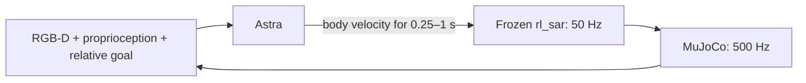

# AstraBots

**Can a reasoning agent plan routes and navigate a robot through terrain?**

We connected Astra to a Go2-W wheeled quadruped in MuJoCo through two interfaces: **world-coordinate path planning with a known terrain map**, and **short movement decisions from RGB-D in an unfamiliar environment**. A frozen **rl_sar locomotion policy** controls the legs and wheels in both settings.

[中文](README.zh-CN.md) · [Known-map planning](docs/KNOWN_MAP.md) · [How it works](docs/ARCHITECTURE.md) · [Results and limitations](docs/EXPERIMENTS.md)

## Two experimental settings

| | Known-map path planning | Unknown-environment RGB-D navigation |
| --- | --- | --- |
| Astra's inputs | Global elevation map, true pose, geometry queries and execution feedback | Head RGB-D, proprioception and ideal relative-goal signal |
| Astra's output | World XY waypoints | Body velocity and duration |
| Execution | PurePursuit → rl_sar; up to 2 s per submission | rl_sar; 0.25, 0.5 or 1 s per action |
| Context | One Codex conversation with cross-episode experience | Fresh isolated context per episode |
| Comparator | Frozen RB-TRG paths, re-executed under the same protocol | Memoryless local velocity rule |

Both pause simulation during model processing. The tasks and protocols differ; this is **not a controlled comparison of map access versus vision**.

## A. Path planning with a known terrain map

Here, Astra chooses and revises its own route from a **global height map and true localization**. Geometry tools evaluate only the paths it proposes; they do not search for a route. PurePursuit follows the submitted waypoints, and rl_sar drives the robot. **There is no RGB-D camera input in this earlier experiment.**

The replays below pair a post-run side-overhead view with the latest **actual recorded map observation**, world-coordinate waypoints and the original brief decision note. Thinking waits are omitted.

### Scene 2: choosing a route around steep terrain — success

Astra entered from the gentler northern side, crossed to the southern half near the central transition, then approached the goal through lower terrain to the west. It travelled **5.44 m** in **16.12 simulated seconds**, using **9 path submissions**.

**[▶ Full video](assets/videos/known-map-scene2.mp4)** · Preview: 4–16 s · seed 600

### Scene 3: a different final approach — success

In the later trial, Astra used a more southern/western exit and aligned on lower terrain before approaching the goal. It completed the task in **20.31 simulated seconds**, with **11 submissions** and **0.238 m** final error.

**[▶ Full video](assets/videos/known-map-scene3-success.mp4)** · Preview: 8–20 s · seed 601

### Scene 3: getting close was not enough — failure

The preceding trial reached the left-side terrain but could not recover near the goal. After **18 submissions**, Astra gave up **0.496 m** away. **Both the route and friction seed changed between these two trials, and the conversation retained the earlier experience.** Their difference cannot be attributed to replanning alone.

**[▶ Full video](assets/videos/known-map-scene3-failure.mp4)** · Preview: 24–35.92 s, plus final hold · seed 600

Across the full four-scene pilot, **Astra succeeded in 3/8 attempts; RB-TRG in 4/8**. All five Astra abandonments count as failures. This shows useful route decisions, but not superiority to the dedicated planner. [Full setting, scene outcomes and caveats →](docs/KNOWN_MAP.md)

## B. Unknown-terrain navigation with RGB-D

In these later experiments, the global map and true pose are withheld. The animations below are excerpts from recorded runs; click for the full-resolution MP4. The side-overhead camera and overview are for the viewer; **Astra receives only the head-camera RGB-D and allowed state inputs**.

**Simulation pauses while Astra thinks.** Replays omit those waits and play at simulation speed.

### 1. Long-range navigation with turns — success

Astra backed away from awkward contact, changed its passing line and continued through the course. It travelled **12.37 m**, reaching the goal in **51.65 simulated seconds** with **52 actions**.

**[▶ Full video](assets/videos/long-flat.mp4)** · Preview: 27–39 s · Go2-W / seed 600

### 2. Navigation over sloped terrain — success

The robot traversed connected course surfaces and turns, travelling **11.50 m** in **55.16 simulated seconds**. The full run includes several recovery attempts before it finds a workable approach.

**[▶ Full video](assets/videos/long-sloped.mp4)** · Preview: 23–35 s · Go2-W / seed 600

### 3. Short uphill task inside the terrain — success

Both endpoints are supported by the course structure. The target surface rises **0.454 m**; the robot's measured body rise is about **0.391 m**, with stopping allowed inside the goal radius.

**[▶ Full video](assets/videos/short-uphill.mp4)** · Complete 8 s run, plus final hold · seed 600

### 4. Repeated recovery attempts — failure

On the wave course, forward, reverse and turning attempts failed to free the robot. Astra explicitly gave up **1.71 m from the goal**. A privileged reference controller had completed this task with the same locomotion policy before evaluation; that route was never given to Astra.

**[▶ Full video](assets/videos/trapped-failure.mp4)** · Preview: 33–45 s, plus final hold · seed 600

## The RGB-D navigation interface

In the RGB-D experiments, Astra receives RGB-D, IMU/joint state, its previous command and an **ideal goal distance/bearing** supplied by the simulator. It retains the current episode's interaction history. It receives no world pose, absolute heading, map, reference route or observer-camera image.

Astra chooses **where and when to move**. The existing policy handles joint targets, wheel speeds and locomotion. The text displayed in the videos is a brief decision note submitted alongside the numeric action; it is not a joint command or a full internal reasoning trace.

In the first RGB-D long success, 51.65 s of simulated motion took **422.17 s of wall time**: about one action per 8.12 real seconds on average, including all overhead. This experiment demonstrates a paused closed loop, not real-time control.

## Results by protocol

| Experiment | Tasks × seeds | Astra successes | Comparator | Comparator successes |
| --- | --- | --- | --- | --- |
| Known-map path planning | 4 × 2 | 3/8 | RB-TRG | 4/8 |
| RGB-D: ground corridors around QRC structures | 6 × 2 | 10/12 | Local rule | 8/12 |
| RGB-D: short terrain-interior tasks | 3 × 2 | 5/6 | Local rule | 2/6 |
| RGB-D: long terrain-interior tasks | 3 × 1 | 2/3 | Local rule | 0/3 |

The **16 known-map executions and 42 RGB-D executions**, including all failures, remain in local research records. This public repository presents selected media and the findings; it does not distribute the experiment scripts or raw test data.

**The protocols differ; the scores should not be pooled.** In the short-interior round, the baseline's finish trigger was 0.25 m while the success radius was 0.30 m, affecting interpretation of the uphill comparison. The long-range round aligned that trigger and added a course-containment rule. The baseline is a simple memoryless local rule, not a mature exploration system. [Details and limitations →](docs/EXPERIMENTS.md)

### RGB-D long-range post-run trajectories

These RGB-D trial trajectories are for post-run analysis and were **not navigation inputs**. In the known-map pilot, Astra did receive the global map and its own past motion; see the [separate planning results](docs/KNOWN_MAP.md).

## What this shows

Astra can propose routes when given a map and make useful short movement decisions from RGB-D. It can also become trapped or fail to find a workable route. These small, idealized simulations do not establish reliable arbitrary-terrain navigation, footstep planning, physical-robot performance or continuous real-time operation.

The known-map pilot uses true map and pose; the RGB-D experiments still receive truth-derived goal guidance. No map or global pose input in the latter does not mean fully unaided localization. No SLAM, odometry estimator, accumulated map or new locomotion training was added.

This is an independent experiment showcase. The earlier pilot used the current Astra/Codex conversation; the RGB-D runs used fresh `gpt-6-astra / medium` threads. These names identify the recorded settings and do not imply affiliation or endorsement. [Acknowledgements](THIRD_PARTY.md) · [License status](LICENSE.md)
