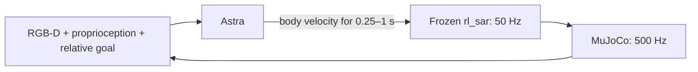

# AstraBots

**Can a reasoning agent navigate an unfamiliar terrain through vision?**

We connected Astra to a Go2-W wheeled quadruped in MuJoCo. It sees head-mounted RGB-D, proprioception and a relative goal, chooses a short movement, then observes the result. A frozen **rl_sar locomotion policy** controls the legs and wheels.

[中文](README.zh-CN.md) · [How it works](docs/ARCHITECTURE.md) · [Results and limitations](docs/EXPERIMENTS.md)

## Watch the robot navigate

The animations below are excerpts from actual recorded runs. Click an animation or its **Full video** link for the full-resolution MP4. All views are synchronized: the side-overhead camera and overview are for the viewer; **Astra receives only the head-camera RGB-D and allowed state inputs**.

**Simulation pauses while Astra thinks.** Replays omit those waits and play at simulation speed.

### 1. Long-range navigation with turns — success

Astra backed away from awkward contact, changed its passing line and continued through the course. It travelled **12.37 m**, reaching the goal in **51.65 simulated seconds** with **52 actions**.

**[▶ Full video](assets/videos/long-flat.mp4)** · Preview: 27–39 s · Go2-W / seed 600

### 2. Navigation over sloped terrain — success

The robot traversed connected course surfaces and turns, travelling **11.50 m** in **55.16 simulated seconds**. The full run includes several recovery attempts before it finds a workable approach.

**[▶ Full video](assets/videos/long-sloped.mp4)** · Preview: 23–35 s · Go2-W / seed 600

### 3. Short uphill task inside the terrain — success

Both endpoints are supported by the course structure. The target surface rises **0.454 m**; the robot's measured body rise is about **0.391 m**, with stopping allowed inside the goal radius.

**[▶ Full video](assets/videos/short-uphill.mp4)** · Complete 8 s run, plus final hold · seed 600

### 4. Repeated recovery attempts — failure

On the wave course, forward, reverse and turning attempts failed to free the robot. Astra explicitly gave up **1.71 m from the goal**. A privileged reference controller had completed this task with the same locomotion policy before evaluation; that route was never given to Astra.

**[▶ Full video](assets/videos/trapped-failure.mp4)** · Preview: 33–45 s, plus final hold · seed 600

## What Astra sees and controls

Astra receives RGB-D, IMU/joint state, its previous command and an **ideal goal distance/bearing** supplied by the simulator. It retains the current episode's interaction history. It receives no world pose, absolute heading, map, reference route or observer-camera image.

Astra chooses **where and when to move**. The existing policy handles joint targets, wheel speeds and locomotion. The text displayed in the videos is a brief decision note submitted alongside the numeric action; it is not a joint command or a full internal reasoning trace.

In the first long success, 51.65 s of simulated motion took **422.17 s of wall time**: about one action per 8.12 real seconds on average, including all overhead. This experiment demonstrates a paused closed loop, not real-time control.

## Results across three experiments

| Experiment | Tasks × seeds | Astra successes | Local-rule successes |
| --- | --- | --- | --- |
| Ground corridors around QRC structures | 6 × 2 | 10/12 | 8/12 |
| Short terrain-interior tasks | 3 × 2 | 5/6 | 2/6 |
| Long terrain-interior tasks | 3 × 1 | 2/3 | 0/3 |

All **42 official executions**, including failures, are retained in the local research archive. This public repository presents selected media and the findings; it does not distribute the experiment scripts or raw test data.

**The protocols differ; the scores should not be pooled.** In the short-interior round, the baseline's finish trigger was 0.25 m while the success radius was 0.30 m, affecting interpretation of the uphill comparison. The long-range round aligned that trigger and added a course-containment rule. The baseline is a simple memoryless local rule, not a mature exploration system. [Details and limitations →](docs/EXPERIMENTS.md)

### Post-run trajectories

These global trajectories are for post-run analysis and were **not navigation inputs**.

## What this shows

Astra can make useful visual navigation decisions and sometimes recover by changing its approach. It can also become trapped or fail to find a workable route. These small, ideal-sensor simulations do not establish reliable arbitrary-terrain navigation, footstep planning, physical-robot performance or continuous real-time operation.

The goal signal is truth-derived assistance. No runtime map or global pose input does not mean fully unaided localization. No SLAM, odometry estimator, accumulated map or new locomotion training was added.

This is an independent experiment showcase. Model names identify the recorded configuration (`gpt-6-astra`, medium) and do not imply affiliation or endorsement. [Acknowledgements](THIRD_PARTY.md) · [License status](LICENSE.md)
