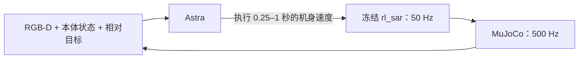

# AstraBots

**能否让具备推理能力的代理，根据视觉感知在陌生地形中导航？**

我们把 Astra 接入 MuJoCo 中的 Go2-W 轮足机器人。它接收头部 RGB-D、本体状态和相对目标信号，决定下一小段运动，再根据执行结果调整。冻结的 **rl_sar locomotion policy** 负责腿和轮子的控制。

[English](README.md) · [系统结构](docs/ARCHITECTURE.md) · [实验结果与局限](docs/EXPERIMENTS.md)

## 直接看机器人如何导航

以下动图均来自真实实验回放。点击动图或「完整视频」可打开对应的高清 MP4。侧上方视角、全景图和真实轨迹供读者事后观察；**Astra 没有看到这些画面，只接收头部 RGB-D 和允许的状态输入。**

**模型思考期间仿真暂停。** 视频按仿真时间播放，省略了等待思考的时间。

### 1. 长程连续换道：成功

Astra 遇到不利接触后后退、调整绕行位置，再返回通道。最终实际行驶 **12.37 米**，用 **52 次动作、51.65 秒仿真时间**到达目标。

**[▶ 完整视频](assets/videos/long-flat.mp4)** · 节选 27–39 秒 · seed 600

### 2. 长程坡面通行：成功

机器人经过连续坡面和转弯，实际行驶 **11.50 米**，用 **55.16 秒仿真时间**完成。完整视频也保留了找到有效通过位置前的多次修正。

**[▶ 完整视频](assets/videos/long-sloped.mp4)** · 节选 23–35 秒 · seed 600

### 3. 地形内部短上坡：成功

起终点均由赛道设施支撑。目标表面高度差为 **0.454 米**；允许在目标半径内停止，因此实测机身升高约 **0.391 米**。

**[▶ 完整视频](assets/videos/short-uphill.mp4)** · 完整 8 秒执行，含末帧停留 · seed 600

### 4. 多次尝试仍无法脱困：失败

在连续起伏地形中，前进、后退和转向都未能让机器人脱困。Astra 在距离目标 **1.71 米**时主动放弃。评测前，同一 locomotion policy 已通过已知路线参考控制完成该任务；参考路线没有提供给 Astra。

**[▶ 完整视频](assets/videos/trapped-failure.mp4)** · 节选 33–45 秒，含末帧停留 · seed 600

## Astra 看到了什么、控制了什么？

Astra 接收 RGB-D、IMU、关节状态、上一条指令，以及仿真提供的**理想目标距离和方位角**。它保留本次任务的交互历史，但没有全局位姿、绝对航向、地图、参考路线或第三人称画面。

Astra 决定**往哪里走、何时调整或停止**；既有 policy 负责关节目标、轮速和运动控制。视频里的文字来自动作附带的简短决策说明，真正驱动执行的是数值速度参数。这些说明不是关节指令，也不是完整内部推理。

第一个长程成功案例的 51.65 秒仿真运动，实际用了 **422.17 秒**；平均约 **8.12 秒提交一次动作**，包含处理与通信开销。这里验证的是暂停式闭环，尚未验证持续实时控制。

## 三轮实验结果

| 实验 | 任务数 × seed 数 | Astra 成功 | 局部规则成功 |
| --- | --- | --- | --- |
| QRC 设施周围的地面通道 | 6 × 2 | 10/12 | 8/12 |
| 地形内部短程任务 | 3 × 2 | 5/6 | 2/6 |
| 地形内部长程任务 | 3 × 1 | 2/3 | 0/3 |

**全部 42 次正式执行及失败记录保留在本地研究归档中。** 公开仓库展示精选视频、图片、方法和结论，实验脚本与原始测试数据不随仓库发布。

**三轮协议不同，不合并宣称总成功率。** 短程内部实验中，基线的结束触发阈值为 0.25 米，统一成功半径为 0.30 米，影响上坡比分的解释；长程轮次统一了该阈值，并增加留在赛道上的要求。局部规则基线较简单，不能据此概括为全面优于传统导航。[详细说明 →](docs/EXPERIMENTS.md)

### 事后轨迹

全局轨迹只用于事后分析，**不是 Astra 的导航输入**。

## 能得出的结论

Astra 可以做出有用的视觉导航决策，并在部分情况下通过调整路线恢复前进；它也会卡住或找不到可行走法。少量理想感知仿真尚不足以证明任意复杂地形的可靠导航、抬腿规划、真机能力或持续实时运行。

相对目标来自仿真真值，因此没有地图和全局位姿输入，不等于完全无定位辅助。本实验没有增加 SLAM、里程计或累计地图，也没有训练新的 locomotion policy。

这是独立实验展示。模型名称说明实际运行配置（`gpt-6-astra`、medium），不代表官方背书。[致谢与素材来源](THIRD_PARTY.md) · [许可证状态](LICENSE.md)
