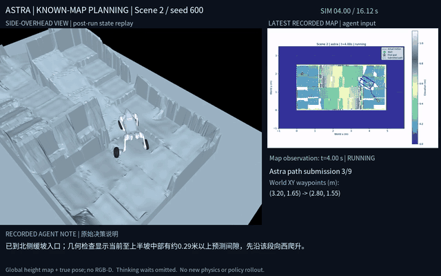
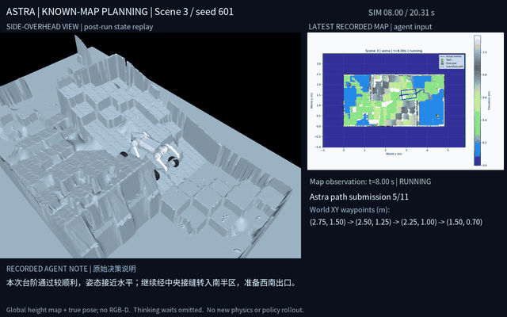
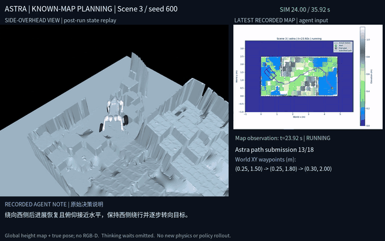
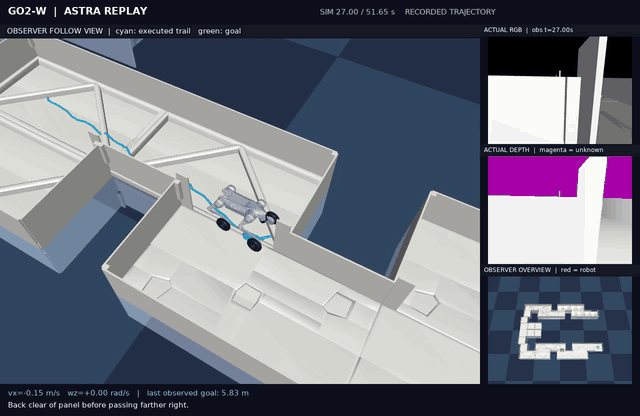
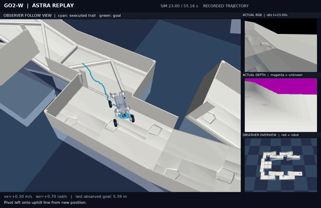
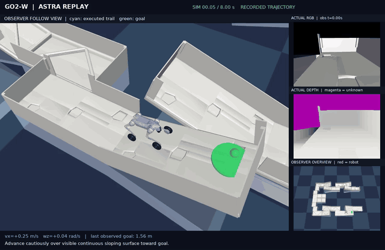
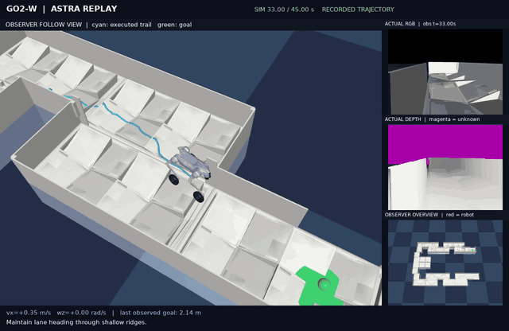
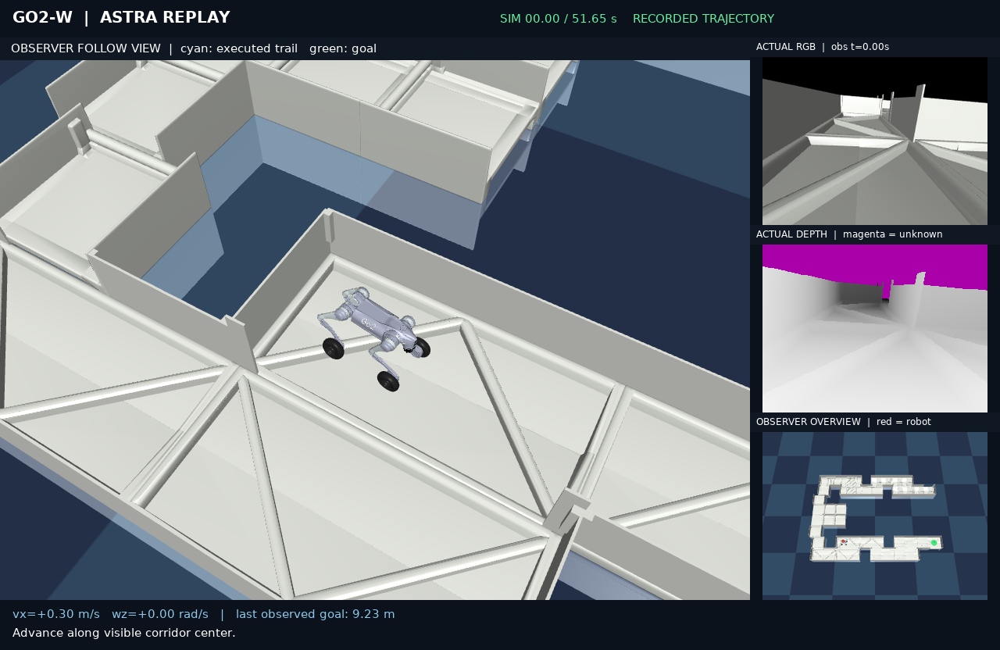
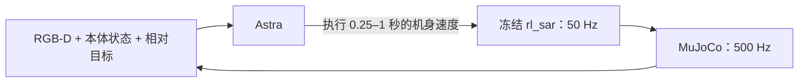
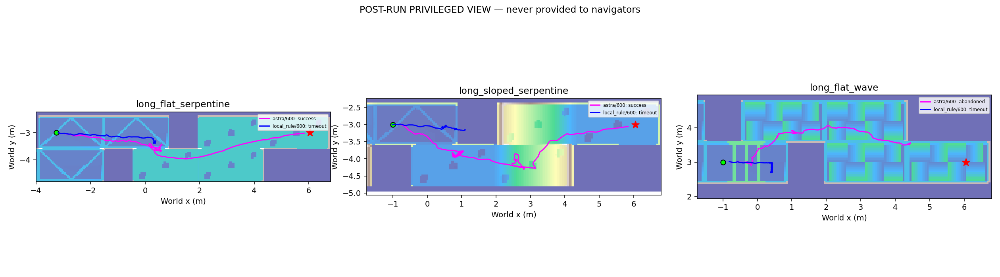

# AstraBots

**能否让具备推理能力的代理，为机器人规划路线并在地形中导航？**

我们通过两种接口把 Astra 接入 MuJoCo 中的 Go2-W：**已知地形地图时，直接选择与修正世界坐标路径；首次进入未知环境时，根据 RGB-D 决定短时运动。** 两种设置都由冻结的 **rl_sar locomotion policy** 控制腿和轮子。

[English](README.md) · [已知地图路径规划](docs/KNOWN_MAP.md) · [系统结构](docs/ARCHITECTURE.md) · [实验结果与局限](docs/EXPERIMENTS.md)

## 两种实验设置

| | 已知地图路径规划 | 未知环境 RGB-D 导航 |
| --- | --- | --- |
| Astra 输入 | 全局高度图、真实定位、几何查询与执行反馈 | 头部 RGB-D、本体状态、理想相对目标 |
| Astra 输出 | 世界坐标 XY 航点 | 机身速度与执行时长 |
| 执行链路 | PurePursuit → rl_sar；每段最多 2 秒 | rl_sar；每次 0.25、0.5 或 1 秒 |
| 上下文 | 同一 Codex 会话，保留跨任务经验 | 每个 episode 创建独立隔离上下文 |
| 对照 | 冻结 RB-TRG 路径在相同协议下重新执行 | 无长期记忆的局部速度规则 |

两种设置都在模型思考时暂停仿真。地形、任务和协议不同，**不能据此直接比较「有地图」与「只有视觉」的能力差异。**

## A. 已知地形地图：让 Astra 参与路径规划

这一轮中，Astra 根据**全局高度图与真实定位**自行选路。几何工具只评价它提出的路径，不搜索替代路线。提交的航点由 PurePursuit 跟踪，再交给 rl_sar 控制机器人。**早期这组实验没有头部 RGB-D 输入。**

下面的回放同屏显示：事后侧上方视角、当时最新的**原始地图观察**、世界坐标航点，以及原始简短决策说明。模型思考等待已省略。

### Scene 2：避开陡边、组织通过路线——成功

Astra 先从北侧缓坡进入中央区域，在过渡处转入南半部，再从西侧低地接近目标。实际行驶 **5.44 米**，用 **9 次路径提交、16.12 秒仿真时间**完成。

**[▶ 完整视频](assets/videos/known-map-scene2.mp4)** · 节选 4–16 秒 · seed 600

### Scene 3：改变末段接近方式——成功

后一次试验选择了更偏南、偏西的出口，先在低地对齐，再接近目标。用 **11 次提交、20.31 秒仿真时间**完成，最终误差 **0.238 米**。

**[▶ 完整视频](assets/videos/known-map-scene3-success.mp4)** · 节选 8–20 秒 · seed 601

### Scene 3：接近目标仍然失败

前一次试验通过中央地形后，在目标附近无法恢复持续运动，最终在 **18 次提交后、距离目标 0.496 米处**主动放弃。**两次试验同时改变了路线和摩擦 seed，而且同一会话保留了前次经验**，不能将结果差异仅归因于重新选路。

**[▶ 完整视频](assets/videos/known-map-scene3-failure.mp4)** · 节选 24–35.92 秒，含末帧停留 · seed 600

完整四场景试验中，**Astra 成功 3/8，RB-TRG 成功 4/8**。Astra 的五次主动放弃均计入失败。这证明了有用的在线选路行为，但未证明优于专门规划器。[完整设置、逐场景结果与局限 →](docs/KNOWN_MAP.md)

## B. 未知地形：让 Astra 根据 RGB-D 导航

后续这几轮不向 Astra 提供全局地图或真实位姿。以下动图均来自真实实验回放，点击可打开完整高清 MP4。侧上方视角、全景图和真实轨迹供读者事后观察；**Astra 没有看到这些画面，只接收头部 RGB-D 和允许的状态输入。**

**模型思考期间仿真暂停。** 视频按仿真时间播放，省略了等待思考的时间。

### 1. 长程连续换道：成功

Astra 遇到不利接触后后退、调整绕行位置，再返回通道。最终实际行驶 **12.37 米**，用 **52 次动作、51.65 秒仿真时间**到达目标。

**[▶ 完整视频](assets/videos/long-flat.mp4)** · 节选 27–39 秒 · seed 600

### 2. 长程坡面通行：成功

机器人经过连续坡面和转弯，实际行驶 **11.50 米**，用 **55.16 秒仿真时间**完成。完整视频也保留了找到有效通过位置前的多次修正。

**[▶ 完整视频](assets/videos/long-sloped.mp4)** · 节选 23–35 秒 · seed 600

### 3. 地形内部短上坡：成功

起终点均由赛道设施支撑。目标表面高度差为 **0.454 米**；允许在目标半径内停止，因此实测机身升高约 **0.391 米**。

**[▶ 完整视频](assets/videos/short-uphill.mp4)** · 完整 8 秒执行，含末帧停留 · seed 600

### 4. 多次尝试仍无法脱困：失败

在连续起伏地形中，前进、后退和转向都未能让机器人脱困。Astra 在距离目标 **1.71 米**时主动放弃。评测前，同一 locomotion policy 已通过已知路线参考控制完成该任务；参考路线没有提供给 Astra。

**[▶ 完整视频](assets/videos/trapped-failure.mp4)** · 节选 33–45 秒，含末帧停留 · seed 600

## RGB-D 实验的感知与控制接口

在 RGB-D 实验中，Astra 接收 RGB-D、IMU、关节状态、上一条指令，以及仿真提供的**理想目标距离和方位角**。它保留本次任务的交互历史，但没有全局位姿、绝对航向、地图、参考路线或第三人称画面。

Astra 决定**往哪里走、何时调整或停止**；既有 policy 负责关节目标、轮速和运动控制。视频里的文字来自动作附带的简短决策说明，真正驱动执行的是数值速度参数。这些说明不是关节指令，也不是完整内部推理。

第一个 RGB-D 长程成功案例的 51.65 秒仿真运动，实际用了 **422.17 秒**；平均约 **8.12 秒提交一次动作**，包含处理与通信开销。这里验证的是暂停式闭环，尚未验证持续实时控制。

## 按协议分别报告的实验结果

| 实验 | 任务数 × seed 数 | Astra 成功 | 对照方法 | 对照成功 |
| --- | --- | --- | --- | --- |
| 已知地图路径规划 | 4 × 2 | 3/8 | RB-TRG | 4/8 |
| RGB-D：QRC 设施周围的地面通道 | 6 × 2 | 10/12 | 局部规则 | 8/12 |
| RGB-D：地形内部短程任务 | 3 × 2 | 5/6 | 局部规则 | 2/6 |
| RGB-D：地形内部长程任务 | 3 × 1 | 2/3 | 局部规则 | 0/3 |

**已知地图的 16 次执行、RGB-D 的 42 次执行及全部失败记录均保留在本地。** 公开仓库展示精选视频、图片、方法和结论，实验脚本与原始测试数据不随仓库发布。

**各轮协议不同，不合并宣称总成功率。** RGB-D 短程内部实验中，基线的结束触发阈值为 0.25 米，统一成功半径为 0.30 米，影响上坡比分的解释；长程轮次统一了该阈值，并增加留在赛道上的要求。局部规则基线较简单，不能据此概括为全面优于传统导航。[详细说明 →](docs/EXPERIMENTS.md)

### RGB-D 长程实验的事后轨迹

这些 RGB-D 试验的全局轨迹只用于事后分析，**不是 Astra 的导航输入**。已知地图试验则允许 Astra 查看全局图与自身此前的运动轨迹，见[单独的规划结果](docs/KNOWN_MAP.md)。

## 能得出的结论

Astra 可以根据地图提出路线，也能从 RGB-D 做出有用的短时导航决策；它仍然会卡住或找不到可行走法。少量理想化仿真尚不足以证明任意复杂地形的可靠导航、抬腿规划、真机能力或持续实时运行。

已知地图试验使用真实地图与定位；RGB-D 试验也仍有真值生成的目标指引，因此后者没有地图和全局位姿输入，不等于完全无定位辅助。本实验没有增加 SLAM、里程计或累计地图，也没有训练新的 locomotion policy。

这是独立实验展示。早期规划试验使用当时的 Astra/Codex 会话，RGB-D 试验使用独立的 `gpt-6-astra / medium` thread；这些名称说明运行配置，不代表官方背书。[致谢与素材来源](THIRD_PARTY.md) · [许可证状态](LICENSE.md)
