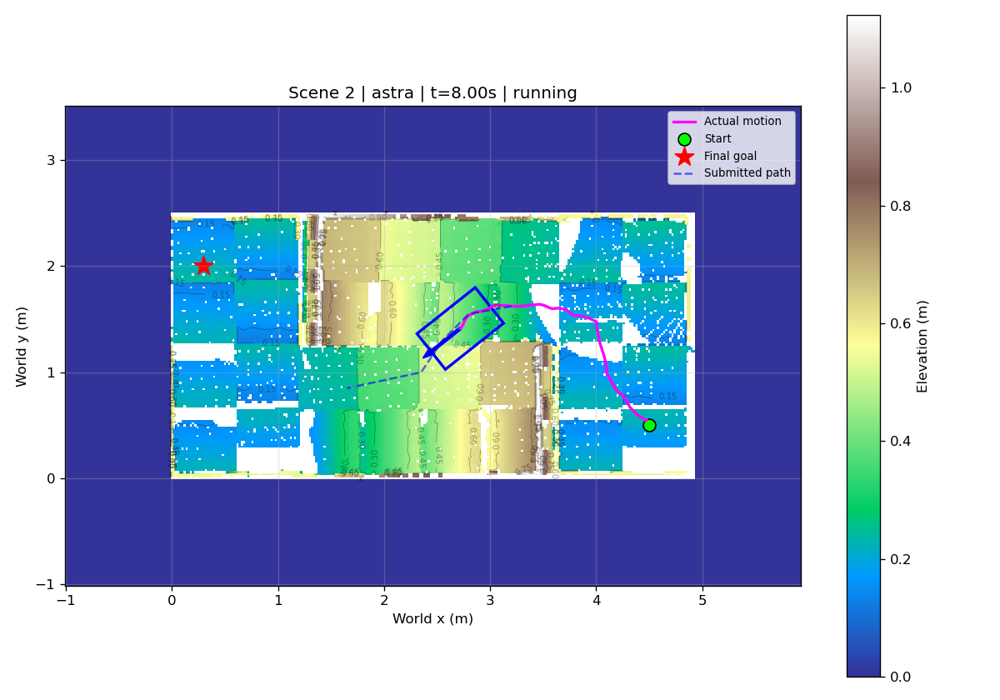
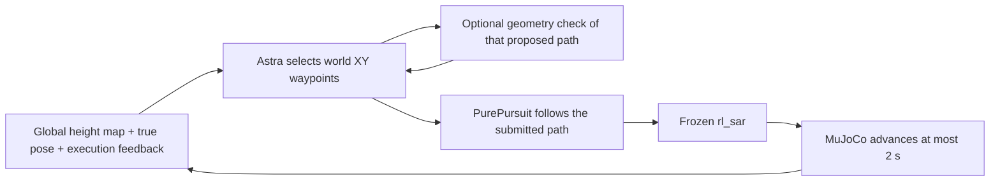
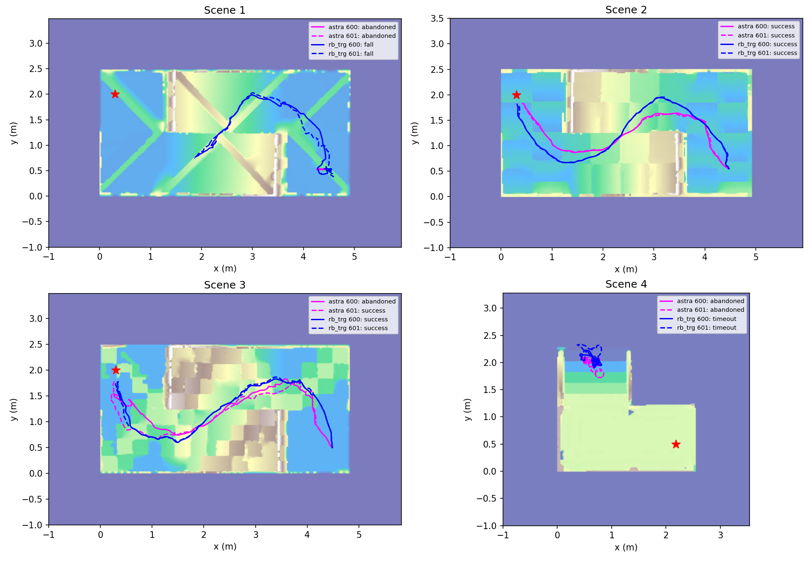

# Known-map path planning with Astra

[中文首页](../README.zh-CN.md) · [Demos](../README.md) · [RGB-D comparison setting](ARCHITECTURE.md)

This earlier experiment asks whether the current Astra/Codex conversation can
choose and revise a traversable route when the **global elevation map and robot
pose are already available**. It was completed on 2026-09-16 in the local
`agentic_robotics` project. It uses Go2-W, frozen rescue-terrain heightfields,
PurePursuit and a frozen rl_sar policy.

It is an information-rich planning experiment. It does **not** use a head RGB-D
camera, LiDAR, SLAM or estimated localization. Geometry and position come from
the simulator and frozen map. This is distinct from the later sensor-only
navigation interface featured elsewhere in this repository.

## What the agent actually received

This is an actual recorded observation, not a newly planned route. It contains
the global elevation map, world axes, current pose/heading, final goal, actual
motion so far and the previously submitted path. No RB-TRG baseline path is
overlaid. Separate numeric feedback includes position, orientation, velocity,
contacts, clearance, target error and the previous segment's outcome.

### The planning loop

- `inspect_terrain(bounds)` reads a local crop from the known map, including the known mask.
- `check_segment(path_xy)` evaluates the submitted path and turns: support inclination, clearance, wheel-height differences and unknown regions.
- `execute_segment(obs_id, path_xy, note)` follows the next submitted polyline for at most two simulated seconds and returns fresh feedback.
- `observe()` does not advance simulation; `stop(reason)` records an abandonment.

The geometry tools do not search, rank alternative routes or run hypothetical
robot rollouts. Astra chose the waypoints itself. Its protocol prohibited reading
baseline routes/results until all eight Astra attempts had ended. This earlier
current-session pilot did not use the later per-episode App Server isolation.

Paths use world XY metres and are resampled at 0.02 m spacing. The follower
converts them to body velocity; rl_sar then updates leg and wheel targets at
50 Hz, while physics advances at 500 Hz. Robot and policy state persist across
submissions. A local endpoint does not count as the final task goal.

## Recorded examples

| Trial | Outcome | Path submissions | Simulated time | Wall time | Actual travel | Final error |
| --- | --- | --- | --- | --- | --- | --- |
| [Scene 2 / 600](../assets/videos/known-map-scene2.mp4) | success | 9 | 16.120 s | 135.5 s | 5.437 m | 0.206 m |
| [Scene 3 / 601](../assets/videos/known-map-scene3-success.mp4) | success | 11 | 20.310 s | 173.1 s | 6.515 m | 0.238 m |
| [Scene 3 / 600](../assets/videos/known-map-scene3-failure.mp4) | abandoned | 18 | 35.922 s | 403.4 s | 6.594 m | 0.496 m |

### Scene 2: organizing the route around terrain geometry

The initial westward crossing meets a steep edge. Astra instead entered from
the north, moved west on the gentler slope, crossed to the southern half near
the central transition and approached the goal through lower terrain to the west.
It used five geometric checks in seed 600. Both Scene 2 seeds succeeded.

### Scene 3: final approach and recovery

In seed 600, Astra passed the central terrain but became stuck near the goal.
It tried turning north, moving farther west and changing waypoint distance,
then abandoned the run. Reaching within half a metre did not satisfy arrival.

The later seed 601 run used a more southern/western exit, aligned on lower ground
and reached the target. **Route, friction seed and available conversation history
all changed**. The records illustrate different behaviors; they do not establish
that route revision alone caused the success or that Astra learned a generally
reliable recovery skill.

## Complete pilot outcomes

Four fixed start/goal tasks, seeds 600 and 601, two actors: **16 executions**.

| Scene | Astra | RB-TRG | Main observation |
| --- | --- | --- | --- |
| 1 | 0/2, abandoned | 0/2, fell | Astra remained near the start; the baseline got farther before falling |
| 2 | 2/2 | 2/2 | Both completed the task |
| 3 | 1/2 | 2/2 | One Astra near-goal recovery failed |
| 4 | 0/2, abandoned | 0/2, timed out | Both struggled with sustained stair ascent in this setup |
| **Total** | **3/8** | **4/8** | No overall advantage over RB-TRG established |

This comparison figure was generated after evaluation. Baseline routes/results
were not provided to Astra during its attempts.

RB-TRG used each scene's frozen `run_000` route, **re-executed** through the same
follower, policy, friction seed and saved initial state as Astra. These are not
historical paper scores. Both actors used a 90 s simulation budget and the same
fall/arrival checks. Arrival required distance ≤0.25 m, planar speed ≤0.1 m/s and
the protocol's attitude/clearance conditions continuously for 0.5 s, with the
executor automatically holding zero velocity near the final target.

## Limits that matter

- The same Codex conversation retained development and cross-episode experience. These are not independent blind model trials.
- Map and localization are idealized truth inputs. Real sensor perception was not tested here.
- Thinking pauses the simulator. State replay speed is not model response speed.
- All five Astra abandonments count as failures, even though they ended before the full budget. The baseline continued until success, fall or timeout.
- Scene 1 cannot be explained entirely by low-level locomotion limits: the baseline left the initial region. Route selection, recovery and early abandonment matter.
- Scene 4 does not prove the policy can never climb stairs under any command or starting condition.
- Four tasks and two seeds do not establish statistical significance or generalization.
- Token usage and cost were unavailable and were not estimated.

The 16 original source tests and the historical artifact audit passed; the audit
checked eight shared initial states, seven stable successes and 72 Astra path
submissions. During showcase preparation the frozen protocol/assets were verified
again. Source records remain local and unchanged.

## Replay provenance

The new MP4s render the stored qpos/qvel/control records with `mj_forward` only.
They do not advance dynamics or run the policy. Display lighting and terrain
colour are adjusted for visibility. The right panel holds the most recent
recorded map until the next observation, without showing future observations.
Waypoints and Chinese decision notes come from the original submitted actions;
the success end-card is explicitly labelled as an evaluator result.

Full MP4s play at simulation-time speed, omit thinking waits and briefly hold the
final state. README GIFs are compressed, time-labelled excerpts. The rendering
script, timing checks, hashes and all raw records stay local; only selected media
and explanatory text are published.
